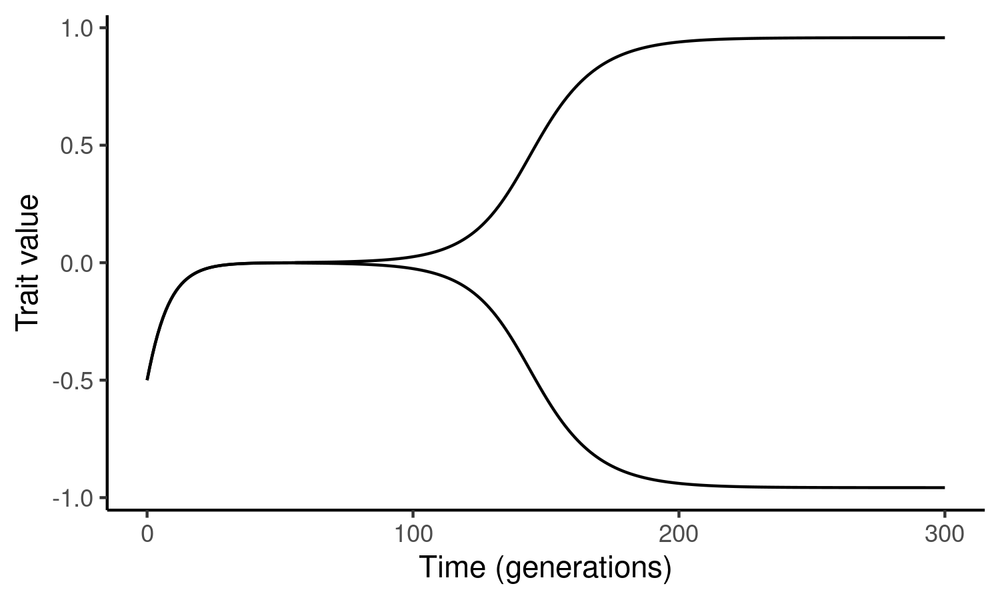
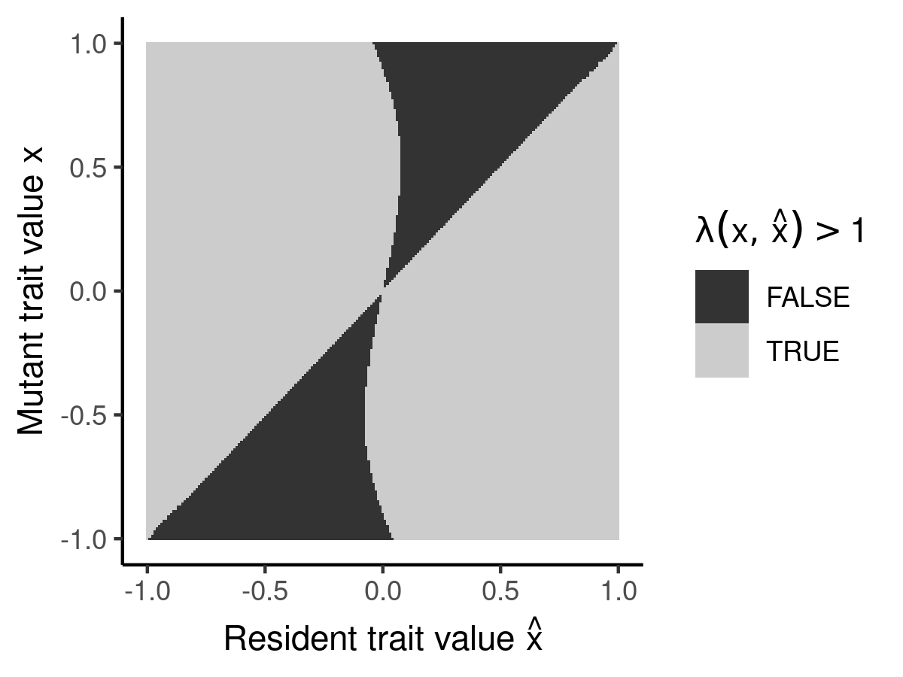

# speciomx

An R package for the analysis of a deterministic approximation of the [speciome](https://github.com/rscherrer/speciome) model using adaptive dynamics.

<!-- badges: start -->
  
<!-- badges: end -->

## Snapshots

 

